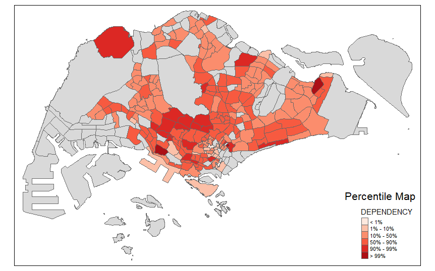
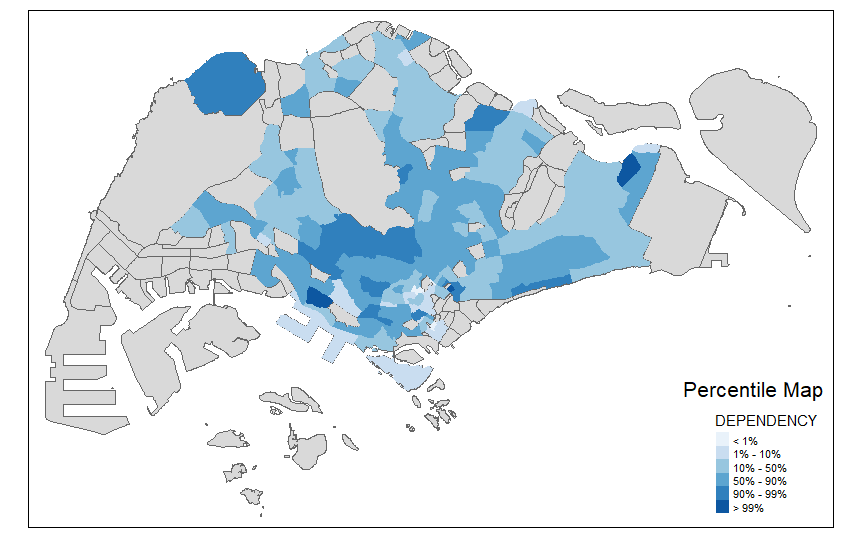

```{r setup, include=FALSE}
knitr::opts_chunk$set(echo = FALSE)
```

## Boxplot

Before learning about Choropleth map and how to code it, we started off with the Boxplot. 

- Boxplot is one one the popular Exploratory Data Analysis (EDA) technique used to show the statistics and distribution of data values.

``` {r echo=TRUE, eval=FALSE}
ggplot(data=mpszpop2020, 
       aes(x = "", 
           y = AGED)) +
  geom_boxplot()
```

## Percentile Map 

In this exercise, we also learnt what's a percentile map. 

- Percentile map is a special type of quantile map with six specific categories: 0-1%,1-10%, 10-50%,50-90%,90-99%, and 99-100%.

- The corresponding breakpoints can be derived as the following: c(0,.01,.1,.5,.9,.99,1)
-- Derived by means of base R quantile command

- The begin and endpoint need to be included 

```{r, echo = FALSE, fig.align = 'center', out.width = '60%'} 
knitr::include_graphics("percentile map.jpg")  
```

## Pre-Processing steps 

Before using the data to create maps or boxplots to make any analysis, we need to clean data by following these steps. 

#### **Step 1: Remove NA data using the following code**

``` {r echo=TRUE, eval=FALSE}
mpszpop2020a <- mpszpop2020 %>%
  drop_na()
```

#### **Step 2: Create function to pull out specific data from the dataset**
Creating a function avoids copy pasting too much in RMarkdown. 

The following code also clearly marks out the quantile categories according to their respective percentage. 

``` {r echo=TRUE, eval=FALSE}
percent <- c(0,.01,.1,.5,.9,.99,1)
var <- mpszpop2020a["DEPENDENCY"] %>%
  st_set_geometry(NULL)
quantile(var[,1], percent)
```

*Result:*
``` {r echo=TRUE, eval=FALSE}
##         0%         1%        10%        50%        90%        99%       100% 
##  0.0000000  0.1377778  0.5686120  0.7024793  0.8474114  1.2100000 19.0000000
```

There are many advantages to writing functions: 

- You can give a function an evocative name that makes your code easier to understand.

- As requirements change, you only need to update code in one place, instead of many.

- You eliminate the chance of making incidental mistakes when you copy and paste (i.e. updating a variable name in one place, but not in another).  


The following code allows you to create the get.var function, which extracts a variable as a vector out of an sf data frame:

``` {r echo=TRUE, eval=FALSE}
get.var <- function(vname,df) {
  v <- df[vname] %>% 
    st_set_geometry(NULL)
  v <- unname(v[,1])
  return(v)
}
```
This step is vital while creating percentile maps. 

#### **Step 3; Plotting the percentile map using tmap functions**

In this step, we can customize how our percentile map should look like. Here is an example of how a percentile map can look like: 

``` {r echo=TRUE, eval=FALSE}
percent <- c(0,.01,.1,.5,.9,.99,1)
var <- get.var("DEPENDENCY", mpszpop2020a)
bperc <- quantile(var,percent)
tm_shape(mpszpop2020) +
  tm_polygons() +
tm_shape(mpszpop2020a) +
  tm_fill("DEPENDENCY",
          title="DEPENDENCY",
          breaks=bperc,
          palette="Blues",
          labels=c("< 1%", "1% - 10%",
                   "10% - 50%", 
                   "50% - 90%",
                   "90% - 99%", 
                   "> 99%"))  +
  tm_borders() +
  tm_layout(title = "Percentile Map", 
            title.position = c("right",
                               "bottom"))
```  

*Result:*
``` {r, echo = FALSE, fig.align = 'center', out.width = '60%'} 
knitr::include_graphics("percentile map.jpg")  
```

We can customise our percentile maps by the following: 

1. Colour 

Refer to this link for a range of colour palettes that are available on RStudio: <https://www.nceas.ucsb.edu/sites/default/files/2020-04/colorPaletteCheatsheet.pdf>

Let's say you want to change the colour to red! You can use this code: 

``` {r echo=TRUE, eval=FALSE}
percent <- c(0,.01,.1,.5,.9,.99,1)
var <- get.var("DEPENDENCY", mpszpop2020a)
bperc <- quantile(var,percent)
tm_shape(mpszpop2020) +
  tm_polygons() +
tm_shape(mpszpop2020a) +
  tm_fill("DEPENDENCY",
          title="DEPENDENCY",
          breaks=bperc,
          palette="Reds", # change the code in this line! 
          labels=c("< 1%", "1% - 10%",
                   "10% - 50%", 
                   "50% - 90%",
                   "90% - 99%", 
                   "> 99%"))  +
  tm_borders() +
  tm_layout(title = "Percentile Map", 
            title.position = c("right",
                               "bottom"))
```  

*Result: *

``` {r, echo = FALSE, fig.align = 'center', out.width = '60%'} 
  
```

2. Borders

You can also remove the borders in the percentile map by removing the following line: 

> tm_borders() +

``` {r, echo = FALSE, fig.align = 'center', out.width = '60%'} 
  
```

Take note that if you want to remove all the borders from the layer below, you will have to customise that layer as well.

``` {r echo=TRUE, eval=FALSE}
percent <- c(0,.01,.1,.5,.9,.99,1)
var <- get.var("DEPENDENCY", mpszpop2020a)
bperc <- quantile(var,percent)
tm_shape(mpszpop2020) + # if you want to change this layer, 
  tm_polygons() + # you will need to use tm_fill() instead of the auto_fill tm_polygon()
tm_shape(mpszpop2020a) +
  tm_fill("DEPENDENCY",
          title="DEPENDENCY",
          breaks=bperc,
          palette="Reds", # change the code in this line! 
          labels=c("< 1%", "1% - 10%",
                   "10% - 50%", 
                   "50% - 90%",
                   "90% - 99%", 
                   "> 99%"))  +
  tm_borders() +
  tm_layout(title = "Percentile Map", 
            title.position = c("right",
                               "bottom"))
```  

3. Legend

You can also customise the legend in this row: 

``` {r echo=TRUE, eval=FALSE}
percent <- c(0,.01,.1,.5,.9,.99,1)
var <- get.var("DEPENDENCY", mpszpop2020a)
bperc <- quantile(var,percent)
tm_shape(mpszpop2020) +
  tm_polygons() + 
tm_shape(mpszpop2020a) +
  tm_fill("DEPENDENCY",
          title="DEPENDENCY",
          breaks=bperc,
          palette="Reds", 
          labels=c("< 1%", "1% - 10%",
                   "10% - 50%", 
                   "50% - 90%",
                   "90% - 99%", 
                   "> 99%"))  +
  tm_borders() +
  tm_layout(title = "Percentile Map", # change this layer to how you see fit!
            title.position = c("right",
                               "bottom"))
```  

## Box Map

- Displaying summary statistics on a choropleth map by using the basic principles of boxplot.

To create a box map, we need to create custom breaks specification. However, the break points for the box map vary depending on whether lower or upper outliers are present.

Firstly, we would need to create the boxbreaks function. 

``` {r echo=TRUE, eval=FALSE}
boxbreaks <- function(v,mult=1.5) {
  qv <- unname(quantile(v))
  iqr <- qv[4] - qv[2]
  upfence <- qv[4] + mult * iqr
  lofence <- qv[2] - mult * iqr
  # initialize break points vector
  bb <- vector(mode="numeric",length=7)
  # logic for lower and upper fences
  if (lofence < qv[1]) {  # no lower outliers
    bb[1] <- lofence
    bb[2] <- floor(qv[1])
  } else {
    bb[2] <- lofence
    bb[1] <- qv[1]
  }
  if (upfence > qv[5]) { # no upper outliers
    bb[7] <- upfence
    bb[6] <- ceiling(qv[5])
  } else {
    bb[6] <- upfence
    bb[7] <- qv[5]
  }
  bb[3:5] <- qv[2:4]
  return(bb)
}
```

- Arguments:
  - v: vector with observations
  - mult: multiplier for IQR (default 1.5)
- Returns:
  - bb: vector with 7 break points compute quartile and fences
  
Secondly, we use the newly created function to remove any NA present in AGED. 

``` {r echo=TRUE, eval=FALSE}
mpszpop2020a <- mpszpop2020 %>%
  filter(AGED>=0)
var <- get.var("AGED", mpszpop2020a)
boxbreaks(var)
```

Here is how the result should look like: 

> [1] -4330     0   515  2080  3745  8590 20240

Lastly, we create the boxmap function. 

``` {r echo=TRUE, eval=FALSE}
boxmap <- function(vnam, df, 
                   legtitle=NA,
                   mtitle="Box Map",
                   mult=1.5){
  var <- get.var(vnam,df)
  bb <- boxbreaks(var)
  tm_shape(df) +
     tm_fill(vnam,title=legtitle,
             breaks=bb,
             palette="Blues",
          labels = c("lower outlier", 
                     "< 25%", 
                     "25% - 50%", 
                     "50% - 75%",
                     "> 75%", 
                     "upper outlier"))  +
  tm_borders() +
  tm_layout(title = mtitle, 
            title.position = c("right",
                               "bottom"))
}
```

The function above takes in the following arguments: \

- vnam: variable name (as character, in quotes)

- df: simple features polygon layer

- legtitle: legend title

- mtitle: map title

- mult: multiplier for IQR

And it returns a tmap-element by plotting a map. 

Use this line to activate our newly created function: 

> boxmap("ECONOMY ACTIVE", mpszpop2020a)

*Results: *

``` {r, echo = FALSE, fig.align = 'center', out.width = '60%'} 
knitr::include_graphics("box map.jpg")  
```

- The box map reveals that there are six upper outliers (i.e. planning subzone with extremely high numbers of aged population)

- Four of the upper outliers are located at the eastern region and they are closed to each others.

- There is no lower outlier.

However, we notice that there where some subzones that have been removed from the original map of Singapore. In order to place it back, we need to insert the original map in the box map function. 

``` {r echo=TRUE, eval=FALSE}
boxmap <- function(vnam, df, 
                   legtitle=NA,
                   mtitle="Box Map",
                   mult=1.5){
  var <- get.var(vnam,df)
  bb <- boxbreaks(var)
  tm_shape(mpszpop2020) + # add this portion
    tm_polygons() + # add this portion
  tm_shape(df) +
    tm_fill(vnam,title=legtitle,
            breaks=bb,
            palette="Blues",
            labels = c("lower outlier", 
                       "< 25%", 
                       "25% - 50%", 
                       "50% - 75%",
                       "> 75%", 
                       "upper outlier"))  +
    tm_borders() +
    tm_layout(title = mtitle, 
              title.position = c("right",
                                 "bottom"))
}
```

*Results: *

``` {r, echo = FALSE, fig.align = 'center', out.width = '60%'} 
knitr::include_graphics("box map1.jpg")  
```

