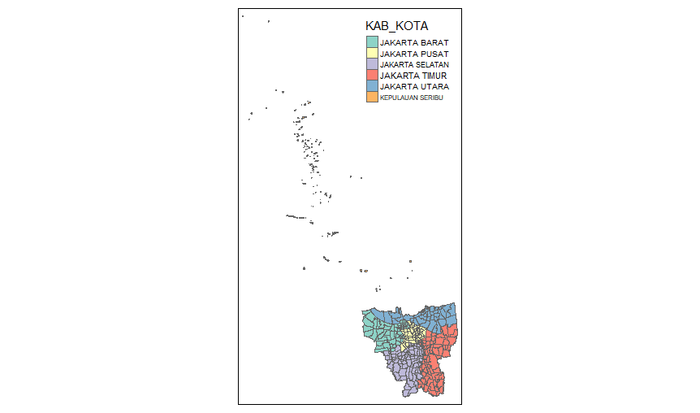
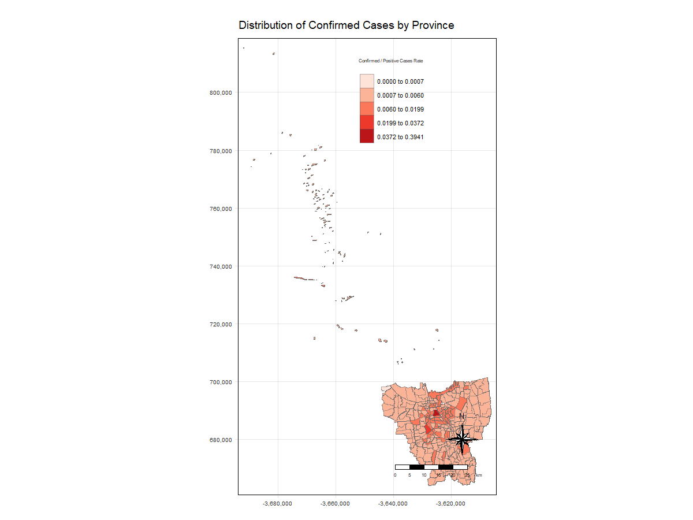

```{r setup, include=FALSE}
knitr::opts_chunk$set(echo = FALSE)
```

# 1. Overview 

The COVID-19 pandemic in Indonesia is part of the ongoing worldwide pandemic of coronavirus disease 2019 (COVID-19) caused by severe acute respiratory syndrome coronavirus 2 (SARS-CoV-2). The virus was confirmed to have reached Indonesia on March 2, 2020. It started with two cases in March. As of July 31 2021, there had been 3,409,658 cumulative confirmed cases of COVID-19 in Indonesia and 94,119 reported cumulative deaths. All cases were spread in 34 provinces in Indonesia. Among all the provinces, DKI Jakarta (Indonesian: Daerah Khusus Ibukota Jakarta and in English: Special Capital Region of Jakarta) contributed close to 24% of the cumulative confirmed cases.

# 2. Objectives 

This exercise aims to use the skill of performing geospatial analysis to "Think Globally, Act Locally". Students will acquire the skills of documenting the analysis procedures conform to reproducible best practice using RMarkdown. Lastly, students will learn how to communicate their work through web post. 

The specific objective of the exercise is to reveal the spatio-temporal patterns of monthly cumulative confirmed COVID-19 rate and death rate at sub-district or kelurahan.

# 3. Data 

- Open Data Covid-19 Provinsi DKI Jakarta: <https://riwayat-file-covid-19-dki-jakarta-jakartagis.hub.arcgis.com/>

  - Data downloaded: 31 March 2020 to 31 August 2021
  
  - Aspatial data that uses the following: ID_KEL, Nama_provinsi, nama_kota, nama_kecamatan nama_kelurahan, POSITIF (cumulative confirmed cases) and meninggal (cumulative death cases) from data worksheet of the daily COVID-19 data
  
  - Students task is to integrate the daily data into a dataframe by month 
  
- Shapefle (SHP) Batas Desa Provinsi DKI Jakarta: <https://www.indonesia-geospasial.com/2020/04/download-shapefile-shp-batas-desa.html>

  - Students are to import the shapefile into R and save it in a simple feature data frame format
  
  - Exclude all the outer islands from the DKI Jakarta sf data frame, and

  - Retain the first nine fields in the DKI Jakarta sf data frame. The ninth field JUMLAH_PEN = Total Population.

# 4. Environment Setup 

Before importing the data and conducting our analysis, we must first set up the environment using the following code: 

``` {r echo=TRUE, eval=FALSE}
packages = c('maptools', 'sf', 'raster','spatstat', 'tmap', 'tidyverse')
for (p in packages){
if(!require(p, character.only = T)){
install.packages(p)
}
library(p,character.only = T)
}
```

# 5. Geospatial Data Wrangling 

Before conducting any analysis, we must first import our data. 

### 4.1 Covid-19 Provinsi DKI Jakarta (Aspatial Data)

Firstly, we need to import the individual data. In this case, we have the data from 31 March 2020 to 31 August 2021. 

``` {r echo=TRUE, eval=FALSE}
covid_data_Apr2020 <- st_read("data/Standar Kelurahan Data Corona (30 April 2020 Pukul 09.00).xlsx")
covid_data_Apr2020 <- covid_data_Apr2020 %>%
  add_column(Date = "Apr 2020")
covid_apr2020 <- covid_data_Apr2020[c("ID_KEL", "Nama_provinsi", "nama_kota", "nama_kecamatan", "nama_kelurahan", 
                                      "POSITIF", "Meninggal", "Date")]
# Repeat this portion for the rest of the 2020 data files provided. 
```

For the 2021 datasets, we need to rename the "Meninggal.1" to "Meninggal" to make it easier to merge the columns of the 2020 and 2021 datasets. 

``` {r echo=TRUE, eval=FALSE}
covid_data_Apr2021 <- st_read("data/Standar Kelurahan Data Corona (30 April 2021 Pukul 10.00).xlsx")
covid_data_Apr2021 <- covid_data_Apr2021 %>%
  add_column(Date = "Apr 2021")
covid_apr2021 <- covid_data_Apr2021[c("ID_KEL", "Nama_provinsi", "nama_kota", "nama_kecamatan", "nama_kelurahan", 
                                      "POSITIF", "Meninggal.1", "Date")]
names(covid_apr2021)[names(covid_apr2021) == "Meninggal.1"] <- "Meninggal"
```

After all the datasets have been cleaned individually, we can combine into the covid_cases function. 

``` {r echo=TRUE, eval=FALSE}
covid_cases <- rbind(covid_apr2020, covid_apr2021, covid_aug2020, covid_aug2021, covid_dec2020, 
                     covid_feb2021, covid_jan2021, covid_jul2020, covid_jul2021, covid_jun2020,
                     covid_jun2021, covid_mar2020, covid_mar2021, covid_may2020, covid_may2021,
                     covid_nov2020, covid_oct2020, covid_sep2020)
```

### 4.2 Batas Desa Provinsi DKI Jakarta (Geospatial Data)

We first import the data in shapefile format using the following formula: 

``` {r echo=TRUE, eval=FALSE}
indonesia = st_read(dsn = "data/BATAS DESA DESEMBER 2019 DUKCAPIL DKI JAKARTA", 
               layer = "BATAS_DESA_DESEMBER_2019_DUKCAPIL_DKI_JAKARTA")
```

This is the result of the above code: 

> Simple feature collection with 269 features and 161 fields \
> Geometry type: MULTIPOLYGON \
> Dimension:     XY \
> Bounding box:  xmin: 106.3831 ymin: -6.370815 xmax: 106.9728 ymax: -5.184322 \
> Geodetic CRS:  WGS 84

We realise that the Geodetic code is WGS 84. However, since we want the data to be more accurate towards Indonesia, we shall set the Geodetic code to EPSG: 23845. 

``` {r echo=TRUE, eval=FALSE}
indonesia_23845 <- st_transform(indonesia,
                                crs = 23845)
```

Check the Geodetic code to see if it has been updated. 

``` {r echo=TRUE, eval=FALSE}
st_crs(indonesia_23845)
```

The results should show that the CRS has been changed.

```{r, echo = FALSE, fig.align = 'center', out.width = '60%'} 
knitr::include_graphics("indonesia crs.jpg")  
```

After changing the Geodetic code, we move on to drop the irrelevant columns from the dataset. 

``` {r echo=TRUE, eval=FALSE}
indonesia_23845 <- indonesia_23845[c(1:9)]
```

### 4.3 Geospatial Data Integration

When both datasets have been cleaned, we can start integrating the 2 datasets into a simple feature data frame. To combine the datasets, we use _left_join()_ of the *dplyr* package to join the covid cases and the Indonesia map. 

``` {r echo=TRUE, eval=FALSE}
covid_indonesia <- left_join(indonesia_23845, covid_cases,
                             by = c("KODE_DESA" = "ID_KEL"))
```

After joining the data, we can start checking the content of the simple feature data frame, _covid_indonesia_. 

``` {r echo=TRUE, eval=FALSE}
st_geometry(covid_indonesia)
```

Using this function would result in the following: 

```{r, echo = FALSE, fig.align = 'center', out.width = '60%'} 
knitr::include_graphics("st_geometry(covid_indonesia).jpg")  
```

As we can see from the results above, the Projected CRS has been corrected to DGN95, which is the official geographic coordinate system for Indonesia. 

We can also use the _glimpse()_ function to view a summary of the information. 

``` {r echo=TRUE, eval=FALSE}
glimpse(covid_indonesia)
```

Using this function would result in the following: 

```{r, echo = FALSE, fig.align = 'center', out.width = '60%'} 
knitr::include_graphics("glimpse(covid_indonesia).jpg")  
```

The results shows us a summary of _covid_indonesia_ by showing us information such as the number of rows and columns and what each column represents. 

Now that we know that the data has been joined correctly, we can proceed to plot _covid_indonesia_. 

``` {r echo=TRUE, eval=FALSE}
plot(covid_indonesia)
```

```{r, echo = FALSE, fig.align = 'center', out.width = '100%'} 
knitr::include_graphics("plot(covid_indonesia).jpg")  
```


**4.3.1 Cumulative Confirmed Cases Rate**

To find out what's the cumulative confirmed cases rate, we need to calculate the total number of positive cases in Indonesia and divide it by the total population before multiplying it by 10,000 to get the number of cases per 10,000 population.

> Cumulative Confirmed Cases Rate = (Number of Positive Cases / Total Population) * 10000

In order to calculate this, we first need to find out the number of positive cases and total population separately. 

Firstly, we remove all the N/A values from _covid_indonesia_. This will not only prevent errors from occurring but also it also helps us calculate the rate more accurately.

``` {r echo=TRUE, eval=FALSE}
# Checking to see if there are any N/A values in the dataframe. 
covid_indonesia[rowSums(is.na(covid_indonesia))!= 0,]

# Removing the N/A values from the data frame using function na.omit()
covid_indonesia <- na.omit(covid_indonesia)
```

After we ensure that all the N/A values have been removed, we create a new column, _Cumulative Cases Rate_, to calculate the rate of cases per line of information.

``` {r echo=TRUE, eval=FALSE}
covid_indonesia <- covid_indonesia %>%
  mutate(`Cumulative Cases Rate` = covid_indonesia$POSITIF/covid_indonesia$JUMLAH_PEN)
```

Lastly, we take the sum of the cumulative cases in the _Cumulative Cases Rate_ column to find the rate of positive Covid-19 cases in Indonesia. 

``` {r echo=TRUE, eval=FALSE}
sum(covid_indonesia$`Cumulative Cases Rate`)
```

*_Results:_*

> sum(covid_indonesia$`Cumulative Cases Rate`) \
> [1] 101.8571

This shows that for every 10,000 people, 101.8571 people will be positive with Covid-19. 


**4.3.2 Cumulative Death Rate**

To find out the cumulative Death Rate, we need to calculate the total number of deaths divided by the total number of positive cases. Since the _covid_indonesia_ dataset has already been cleaned, we can proceed to extract the total number of deaths. 

> Cumulative Confirmed Death Rate = (Total Number of Deaths / Total Positive Cases) * 10000

In order to calculate this, we first need to find out the number of positive cases and total population separately. 

Firstly, we create a new column, _Cumulative Death Rate_, to calculate the rate of deaths per line of information.

``` {r echo=TRUE, eval=FALSE}
covid_indonesia <- covid_indonesia %>%
  mutate(`Cumulative Death Rate` = covid_indonesia$Meninggal/covid_indonesia$POSITIF)
```

Afterwards, we take the sum of the cumulative cases in the _Cumulative Death Rate_ column to find the rate of deaths for every positive case. 

``` {r echo=TRUE, eval=FALSE}
sum(covid_indonesia$`Cumulative Death Rate`)
```

The line of code should showw us the number of people who have died from Covid-19 complications.  

### 4.4 Thematic Mapping

We can use _qtm()_ to quickly plot a map. 

``` {r echo=TRUE, eval=FALSE}
tmap_mode("plot")
qtm(covid_indonesia, 
    fill = "KAB_KOTA")
```

This graph aims to show the different subdivisions of Indonesia. 

```{r, echo = FALSE, fig.align = 'center', out.width = '100%'} 
  
```

However, we want to see the distribution of both the cumulative cases rate and the death rate in Indonesia. We can represent the cumulative cases using the following code: 

``` {r echo=TRUE, eval=FALSE}
tm_shape(covid_indonesia)+
  tm_fill("Cumulative Cases Rate", 
          style = "quantile", 
          palette = "Blues",
          title = "Confirmed / Positive Cases Rate") +
  tm_layout(main.title = "Distribution of Confirmed Cases by Province",
            main.title.position = 'center',
            main.title.size = 1.2,
            legend.height = 0.60, 
            legend.width = 0.50,
            frame = TRUE) +
  tm_borders(alpha = 0.5) +
  tm_compass(type="8star", size = 2) +
  tm_scale_bar() +
  tm_grid(alpha =0.2) 
```

*Results: *

```{r, echo = FALSE, fig.align = 'center', out.width = '100%'} 
  
```

We can also take a look at the live version of the map to see which province has the highest cumulative rate. To do that, we can use change the map version to view using the function, _tmap_mode(view)_. 

```{r echo=TRUE, eval=FALSE}
tmap_mode('view')
tm_shape(covid_indonesia)+
  tm_fill("Cumulative Cases Rate", 
          style = "quantile", 
          palette = "Reds",
          title = "Confirmed / Positive Cases Rate") +
  tm_layout(main.title = "Distribution of Confirmed Cases by Province",
            main.title.position = 'center',
            main.title.size = 1.2,
            legend.height = 0.60, 
            legend.width = 0.50,
            frame = TRUE) +
  tm_borders(alpha = 0.5) +
  tm_scale_bar() +
  tm_grid(alpha =0.2) 
```

From the live map, we can check the ID of the province to see which province has the highest cumulative cases rate. 

``` {r echo=TRUE, eval=FALSE}
covid_indonesia$KAB_KOTA[covid_indonesia$OBJECT_ID==25384]
```

*Results: *

> "JAKARTA PUSAT"

From this result, we can tell that the province of Jakarta Pusat has the highest cumulative case rate. 

Let's take a look at the death rate of Indonesia and where it is the highest. We can use a similar function to find out where the highest death rate in Indonesia is. Remember to change the _tmap()_ function back to 'plot'. 

``` {r echo=TRUE, eval=FALSE}
tm_shape(covid_indonesia)+
  tm_fill("Cumulative Death Rate", 
          style = "quantile", 
          palette = "Reds",
          title = "Death Rate Due to Covid-19") +
  tm_layout(main.title = "Distribution of Confirmed Cases by Province",
            main.title.position = 'center',
            main.title.size = 1.2,
            legend.height = 0.60, 
            legend.width = 0.50,
            frame = TRUE) +
  tm_borders(alpha = 0.5) +
  tm_compass(type="8star", size = 2) +
  tm_scale_bar() +
  tm_grid(alpha =0.2) 
```


### 4.5 Analytical Mapping

Before we can do any mapping, we should convert sf data frames to sp's Spatial class. We can use as_Spatial() to convert the 3 geospatial data from simple feature data frame to sp's Spatial class. 

``` {r echo=TRUE, eval=FALSE}
indonesia_covid <- as_Spatial(covid_indonesia)
```

After converting to Spatial class, we need to convert the dataset into Spatial object. 

``` {r echo=TRUE, eval=FALSE}
indonesia_covid_sp <- as(indonesia_covid, "SpatialPoints")
```

Afterwards, we need to convert from Spatial object to spatstat's ppp format. 

``` {r echo=TRUE, eval=FALSE}
indonesia_covid_ppp <- as(indonesia_covid_sp, "ppp")
```

After convert the data, we can plot _indonesia_covid_ppp_. 

``` {r echo=TRUE, eval=FALSE}
plot(indonesia_covid_ppp)
```

**4.5.1 Duplicated point**

To have a more accurate analysis, we need to remove any duplicates in the dataset. We can use the following code: 

``` {r echo=TRUE, eval=FALSE}
any(duplicated(indonesia_covid_ppp))
```

**4.5.2 Plotting the graph**

We can plot the graph using the ppp format with the following code: 

``` {r echo=TRUE, eval=FALSE}
tmap_mode('view')
tm_shape(indonesia_covid) +
  tm_dots(alpha=0.4, 
          size=0.05)
```

**4.5.3 Kernel Density Estimation**

We use Kernel Density Estimation to figure out the intensity of the cases in each of the province of Indonesia. We can use the code below to figure out the intensity. 

``` {r echo=TRUE, eval=FALSE}
kde_indonesia_covid_bw <- density(indonesia_covid_ppp,
                              sigma=bw.diggle,
                              edge=TRUE,
                            kernel="gaussian") 
```

In order to compute the KDE layer, we need to retrieve the bandwidth. 

``` {r echo=TRUE, eval=FALSE}
bw <- bw.diggle(indonesia_covid_ppp)
```

After computing the KDE layer, we need to rescale in order to convert the unit of measurement and then re-run the density to plot the output. 

``` {r echo=TRUE, eval=FALSE}
indonesia_covid_ppp.km <- rescale(indonesia_covid_ppp, 1000, "km") 
kde_indonesia_covid.bw <- density(indonesia_covid_ppp.km, sigma=bw.diggle, edge=TRUE, kernel="gaussian")
plot(kde_Indonesia_covid.bw)
```

Aside from _bw.diggle()_, we can use the following functions to determine the bandwidth: _bw.CvL()_, _bw.scott()_, and _bw.ppl()_.

``` {r echo=TRUE, eval=FALSE}
bw.CvL(indonesia_covid_ppp.km)
bw.scott(indonesia_covid_ppp.km)
bw.ppl(indonesia_covid_ppp.km)
```

_bw.ppl()_ is used because it tends to produce more appropriate values when the pattern consists of tight clusters. However, _bw.diggle()_ is best used to detect a single tight cluster in the midst of random noise. We can use the code below to compare the results from both _bw.ppl()_ and _bw.diggle()_. 

``` {r echo=TRUE, eval=FALSE}
kde_indonesia_covid.ppl <- density(indonesia_covid_ppp.km, 
                               sigma=bw.ppl, 
                               edge=TRUE,
                               kernel="gaussian")
par(mfrow=c(1,2))
plot(kde_childcareSG.bw, main = "bw.diggle")
plot(kde_childcareSG.ppl, main = "bw.ppl")
```

**4.5.4 Converting to Raster Layer**

Last but not least, we need to convert the kernel density objects into RasterLayer object by using raster(). 

``` {r echo=TRUE, eval=FALSE}
kde_indonesia_covid_bw_raster <- raster(gridded_kde_indonesia_covid_bw)
```

From the crs property, we can tell that we need to assign the proper projection system. 

``` {r echo=TRUE, eval=FALSE}
projection(kde_indonesia_covid_bw_raster) <- CRS("+init=EPSG:23845")
```

After we have set the crs property, we can then visualise the output in tmap. 

``` {r echo=TRUE, eval=FALSE}
tm_shape(kde_childcareSG_bw_raster) + 
  tm_raster("v") +
  tm_layout(legend.position = c("right", "bottom"), frame = FALSE)
```

Based on the results, we can display which provinces were hit the hardest by Covid-19 by referring to the number of cases that has been displayed in each region and the death rate of these places that has been hit by it. 

